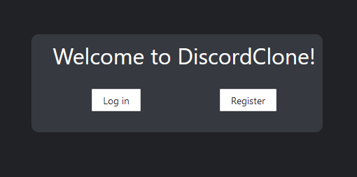
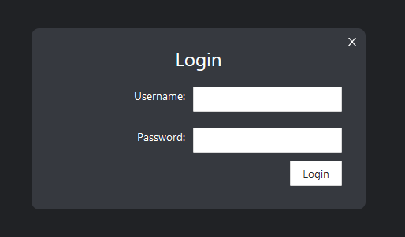
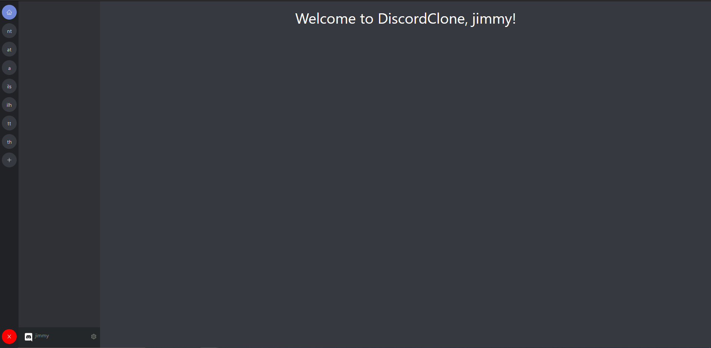
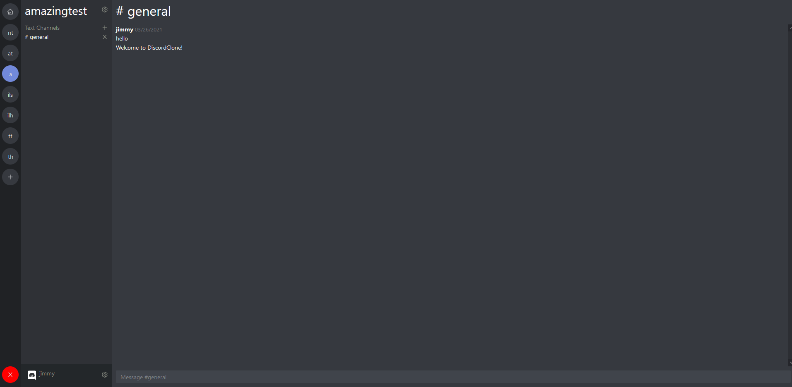

# CsabaChat

CsabaChat egy telekommunkiciós alkalmazás amely a felhő technológiák implementálásával egy igazán modern és biztonságos élményt nyújt a felhasználóinak.

---

## Welcome Page

---

## Login Page

---

## Homepage

---

## Csevegés minta

---
## Technologies used

- [React](https://reactjs.org/) - Frontend készült vele
- [.NET](https://docs.microsoft.com/en-us/dotnet/) - Backend készült benne
- [EF Core](https://docs.microsoft.com/en-us/ef/core/) - ORM (Object Relational Mapper) a .NET által kezelt adatbázisokhoz
- [Microsoft SQL Server](https://www.microsoft.com/en-us/sql-server/sql-server-2019) - Microsoft Relational Database
- [antdesign](https://ant.design/) - UI keretrendszer React-hoz
- [datefns](https://date-fns.org/) - JavaScript könyvtár, dátum pars-oláshoz
- [formik](https://formik.org/) - React.js könyvtár
- [axios](https://github.com/axios/axios) - Http Kliens node.js-hez

---

## License

[MIT](https://choosealicense.com/licenses/mit/)
